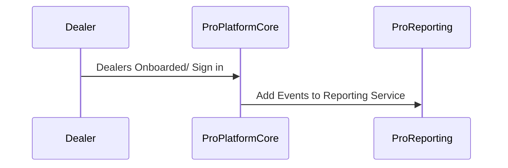

import Footer from "@catalog/components/footer.astro";

The Fluidra Pro domain is the core business domain of Fluidra. Fluidra Pro allows professionals to partner with Fluidra to help manage and grow their professional business. This includes business software that makes running professionals day-to-day easier and personalized loyalty programs that help professionals earn rewards on their purchases.

<Tiles>
  <Tile
    icon="UserGroupIcon"
    href="/docs/teams/full-stack"
    title="Engineering Support"
    description="Questions? Contact our full-stack team for technical support"
  />
  <Tile
    icon="RectangleGroupIcon"
    href={`/visualiser/domains/${frontmatter.id}/${frontmatter.version}`}
    title="Domain Architecture"
    description="Explore our domain structure and service interactions"
  />
</Tiles>

## Domain Overview

Fluidra Pro SOT

## Sub domains

The Fluidra Pro domain is built on the following sub domains:

- <ResourceLink id="PlatformCore" type="domain">
    Platform Core
  </ResourceLink>
- <ResourceLink id="Reporting" type="domain">
    Reporting
  </ResourceLink>

## Target Architecture (Event Storming Results)

Our target architecture was defined through collaborative event storming sessions with product, engineering, and business stakeholders.

## Current Production Architecture

Our current event-driven architecture powering Fluidra Pro experience:

<NodeGraph />

### Order Processing Flow

## Key Business Flows

## Core Services

These services form the backbone of Fluidra's operations:

<ResourceGroupTable
  id="related-resources"
  limit={7}
  showOwners={true}
  description="Essential services powering our fluidra platform"
/>

## Performance SLAs

TBD

## Monitoring & Alerts

TBD

<Footer />
